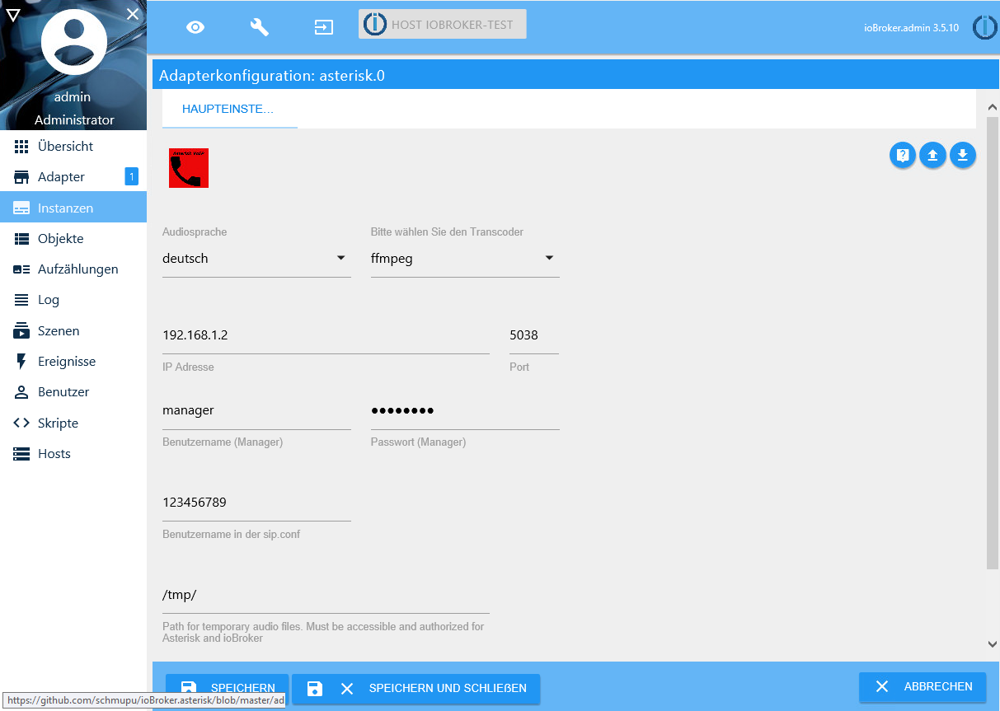

# ioBroker Asterisk VoIP Adapter


[](https://travis-ci.org/schmupu/ioBroker.asterisk)
[](https://ci.appveyor.com/project/schmupu/ioBroker-asterisk/)
[](https://www.npmjs.com/package/iobroker.asterisk)
[](https://www.npmjs.com/package/iobroker.asterisk)

[](https://nodei.co/npm/iobroker.asterisk/)

The Asterisk adapter converts text messages to audio files and calls then over Asterisk by voip any telephone number you want and plays the audo message.

## Install & Configuration

You have to install asterisk for voip calls and ffmpeg to transcode mp3 audofiles to GSM audiofiles on your ioBroker hardware. For creating text messages to audio messages the online text to speach tool from Google will be used. The text message can not be longer than 200 characters.

You can install asterisk and ffmpeg on Linux (Raspberry), Windows and Apple Macs Computer. If you want to install asterisk in a docker container in bridge modus, you have to expose the UDP ports 5038,5060 and the UDP Ports 7078 to 7097. 

Important: asterisk and ffmpeg has to be on the same hardware as ioBroker! The reason is that the audio files are stored locally and accesable from both aplication. Maybe I will add an SFTP tranfer of audio files in one of the following versions.

If you still want to use separated server for ioBroker and Asterisk there is a work around. You still install ffmpeg on the ioBroker server. You have to share a path on a server (for example with cifs), where both ioBroker and Asterisk have read and write access. The path name must on the asterisk and ioBroker server completle identical. The command *ln -s* will help! You have to enter the path in the ioBroker asterisk adapter configuraton (see screenshot below).

if you use Linux (Raspbery for example) you have to install ffmpeg and asterisk like this: 

```sh
sudo apt-get install ffmpeg
sudo apt-get install asterisk
```

Asterisk has to connect for outgoing calls with your voip provider or with your fritz.box! If you use the fritz
box! you have to add a new LAN/WLAN telephone device. In my example the frit.box! has the IP address 192.168.1.1 and the user name is *12345689* und the password is *mypassword* . The telphone number for outgoing and incoming calls is *03047114711*.


If you do not want, that ioBroker answer the phone, please leave "nur auf folgende Rufnummern reagieren" empty.


Now you have to edit the follwoing asterisk configuration files. Delete the old staff in this 3 files! Do not change the user authority of the files.
 
**/etc/asterisk/manager.conf**
```sh
[general]					; Do not change
enabled = yes				; Do not change
port = 5038					; Do not change
bindaddr = 0.0.0.0			; Do not change

[manager]							; Do not change
secret = managerpassword            ; Change Manager password for ioBroker asterisk adapter   
permit = 192.168.1.0/255.255.255.0  ; Change to your subnet and netmask
read = all							; Do not change
write = all							; Do not change
```
You have to change in */etc/asterisk/manager.conf* the values *secret*, *permit* (your subnet + subnet mask)


**/etc/asterisk/sip.conf**
```sh
[general]
port = 5060
bindaddr = 0.0.0.0
context = default
subscribecontext = default


register => 12345689:mypassword@192.168.1.1/1000 ; Username, Password and IP address of Fritzbox WLAN/LAN telephone

[iobroker]               	; Do not change
type = friend			  	; Do not change
username = 123456789      	; Change to username of Fritzbox WLAN/LAN telephone
host = 192.168.1.1        	; Change hostname / IP address of Fritzbox
secret = mypassword       	; Change password of Fritzbox WLAN/LAN telephone
fromdomain = 192.168.1.1  	; Change hostname / IP address of Fritzbox
fromuser = 123456789   	  	; Change username of Fritzbox WLAN/LAN telephone
callerid= 03047114711	  	; Change your telephone number defined in the Fritzbox
```
You have to change in */etc/asterisk/sip.conf* the *host* (IP Adress of Fritzbox or VoIP Provider), the *secret*, *username*, *fromuser* with the username configured in the Fritzbox or VoIP Provider. Change the *callerid* with your phone number configured in the Fritzbox.


**/etc/asterisk/extensions.ael**
```sh
context default {
  	1000 => {
        Goto(ael-antwort,10,1);
  	}
}

context ael-ansage {
	10 => {
		Answer();
		Wait(1);
		for (x=0; ${x} < ${repeat}; x=${x} + 1) {
			Playback(${file});
			Playback(beep);
			Wait(1);
		}
		Hangup();
	}
}

context ael-antwort {
	10  => {
		Answer();
		Wait(1);
		Playback(beep);
    	Wait(10);
    	Hangup();
	}
}
```
Copy the content above into the */etc/asterisk/extensions.ael* and do not change anything! If you change something here, your ioBroker dial command will not work.


For starting the asterisk server type */etc/init.d/asterisk start*
Now you have to connect ioBroker with the asterisk server. If the ioBroker and the asterisk server use as IP adress 192.168.1.2 you have to configure this IP and the port, username and password from the */etc/asterisk/manager.conf*. You have enter a path for temporary audio files. This path must be accessible and authorized for Asterisk and ioBroker. 



Now you can use the adapter in your javascript or blocky programms.

```sh
var number  = "040 666-7766";
var msg     = "Hello, this textmessage will be converted to audio"; 

// call telephone nummber 040 666-7766 and play text message as audio
sendTo('asterisk.0', "dial", { telnr: number, text:  msg},  (res) => {
      console.log('Result: ' + JSON.stringify(res));
});  

// call telephone nummber 040 666-7766 and play mp3 audio file
// mp3 file has to exist on asterix server
sendTo('asterisk.0', "dial", { telnr: number, aufiofile: '/tmp/audio.mp3'},  (res) => {
      console.log('Result: ' + JSON.stringify(res));
});  

// call telephone nummber 040 666-7766 and play gsm audio file 
// gsm file has to exist on asterix server
sendTo('asterisk.0', "dial", { telnr: number, aufiofile: '/tmp/audio.gsm'},  (res) => {
      console.log('Result: ' + JSON.stringify(res));
});  
```

> You can use following parameter in the sendTo dial statement:
> - **language:** language take for text to speach (tts) function. (allowed values: 'DE', 'EN', ... Default is ioBroker system language)
> - **repeat:** how many times shall the audio message repeated (allowed values 1 to n, default 5)
> - **priority:** if you send “parallel” many sendTo dial  statements, the messages with a smallest priority will be send first (allowed values 1 to n, default 1)
> - **text:** text message that will be send as audio (max 200 characters) 
> - **timeout:** Timeout in milliseconds waiting for connection to be happen (defaults to 60000 ms)
> - **async:** Allows multiple calls to be generated without waiting for a response (allowed values: false/true, default false)
> - **audiofile:** if you using the text parameter. The converted text to audio will be saved in  audiofile. If the audiofile exist, it will be overwritten. If you do not use the parameter text, the audiofile will be played. 


## Changelog

### 0.1.3 (12.11.2018)
* (Stübi) Bugfixing

### 0.1.2 (12.11.2018)
* (Stübi) First Version

### 0.1.1 (11.11.2018)
* (Stübi) First Version


## License
The MIT License (MIT)

Copyright (c) 2018 Thorsten <thorsten@stueben.de> / <https://github.com/schmupu>

Permission is hereby granted, free of charge, to any person obtaining a copy
of this software and associated documentation files (the "Software"), to deal
in the Software without restriction, including without limitation the rights
to use, copy, modify, merge, publish, distribute, sublicense, and/or sell
copies of the Software, and to permit persons to whom the Software is
furnished to do so, subject to the following conditions:

The above copyright notice and this permission notice shall be included in
all copies or substantial portions of the Software.

THE SOFTWARE IS PROVIDED "AS IS", WITHOUT WARRANTY OF ANY KIND, EXPRESS OR
IMPLIED, INCLUDING BUT NOT LIMITED TO THE WARRANTIES OF MERCHANTABILITY,
FITNESS FOR A PARTICULAR PURPOSE AND NONINFRINGEMENT. IN NO EVENT SHALL THE
AUTHORS OR COPYRIGHT HOLDERS BE LIABLE FOR ANY CLAIM, DAMAGES OR OTHER
LIABILITY, WHETHER IN AN ACTION OF CONTRACT, TORT OR OTHERWISE, ARISING FROM,
OUT OF OR IN CONNECTION WITH THE SOFTWARE OR THE USE OR OTHER DEALINGS IN
THE SOFTWARE.
