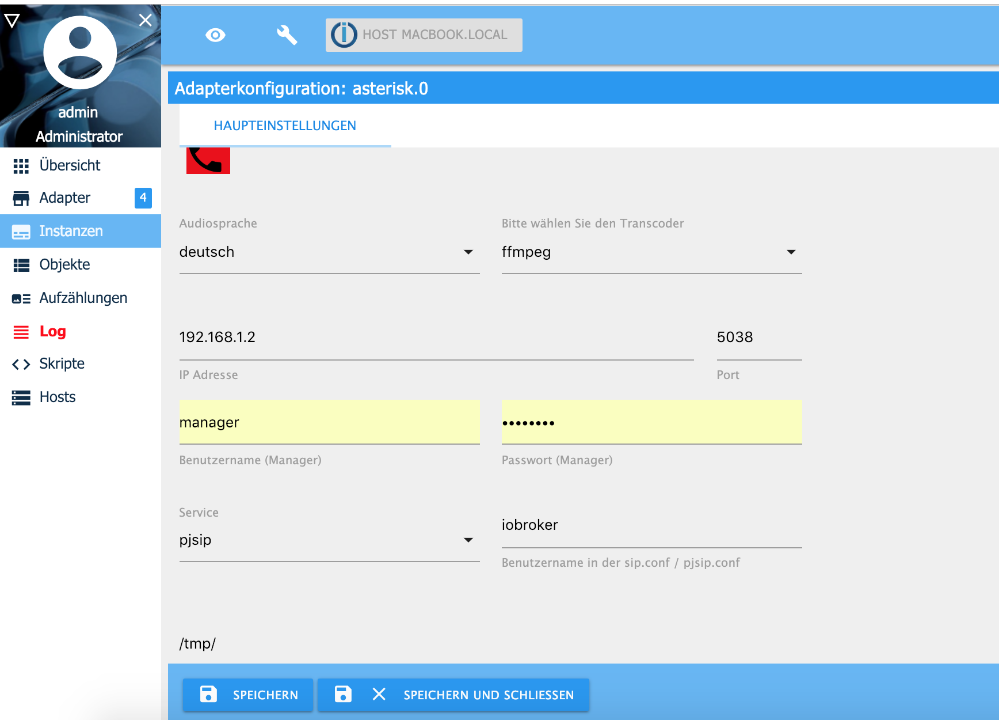

# ioBroker Asterisk VoIP Adapter

## Install & Configuration of Asterisk with the Fritzbox by using PJSIP 

First you have to install all the packages described [here](../README.md).

First you have to open the Fritzbox configuration and add a new LAN/WLAN telephone device. In my example, the FritzBox has the IP address 192.168.1.1 and the user name is *12345689* und the password is *mypassword* . The telphone number for outgoing and incoming calls is *03047114711*.


If you do not want, that ioBroker answer the phone, please leave "nur auf folgende Rufnummern reagieren" empty.  Important, the Fritzbox username (Benutzername) musst only consist of numbers. Example: 12345689, 00004711 or 47110815 !!


Now you have to edit the follwoing asterisk configuration files. Delete the old staff in this 3 files! Do not change the user authority of the files. You have to decide if you want to use the sip.conf or the pjsip.conf . Do not use both files, that would not work!
 
**/etc/asterisk/manager.conf**
```sh
[general]						; Do not change
enabled = yes						; Do not change
port = 5038						; Do not change
bindaddr = 0.0.0.0					; Do not change

[manager]						; Do not change
secret = managerpassword				; Change Manager password for ioBroker asterisk adapter
permit = 192.168.1.0/255.255.255.0  			; Change to your subnet and netmask
read = all						; Do not change
write = all						; Do not change
```

You have to change in */etc/asterisk/manager.conf* the values *secret*, *permit* (your subnet + subnet mask). 

**/etc/asterisk/pjsip.conf** 
```sh
[transport-udp]
type = transport
protocol = udp
bind = 0.0.0.0:5060
 
[iobroker]
type = registration
outbound_auth = iobroker
server_uri = sip:192.168.1.1:5060 ; Username, Password and IP address of Fritzbox WLAN/LAN telephone
client_uri = sip:123456789@192.168.1.1:5060 ; Username, Password and IP address of Fritzbox WLAN/LAN telephone

[iobroker]
type = auth
auth_type = userpass
password = mypassword ; Change password of Fritzbox WLAN/LAN telephone
username = 123456789  ; Change username of Fritzbox WLAN/LAN telephone

[iobroker]
type = aor
contact = sip:192.168.1.1:5060 ; Change hostname / IP address of Fritzbox

[iobroker]
type = endpoint
context = ael-antwort
outbound_auth = iobroker
aors = iobroker
disallow=all
allow=ulaw
allow=alaw
allow=gsm
from_domain = 192.168.1.1 ; Change hostname / IP address of Fritzbox
from_user = 123456789     ; Change username of Fritzbox WLAN/LAN telephone

[iobroker]
type = identify
endpoint = iobroker
match = 192.168.1.1 ; Change hostname / IP address of Fritzbox
```
You have to change in */etc/asterisk/psip.conf* the hostname, username and password configured in the Fritzbox or in the configruation of your VoIP Provider. Pleas do not change the other parameter. 

**/etc/asterisk/extensions.ael**
```sh
context default {
  	1000 => {
        Goto(ael-antwort,s,1);
  	}
}

context ael-ansage {
	10 => {
        Answer();
        Wait(1);
		Read(dtmf,${file}&beep,0,s,${repeat},1);
		if ("${dtmf}"  != "") {
			SayDigits(${dtmf});
		}
		Hangup();
        }
}

context ael-antwort {
	s  => {
		Answer();
		Wait(1);
		Set(repeat=5);
		Read(dtmf,/tmp/asterisk_dtmf&beep,0,s,${repeat},1);
		if ("${dtmf}"  != "") {
			SayDigits(${dtmf});
		}
    		Hangup();
	}
}
```
Copy the content above into the */etc/asterisk/extensions.ael* and do not change anything! If you change something here, your ioBroker dial command will not work.

For starting the asterisk server type */etc/init.d/asterisk start*
Now you have to connect ioBroker with the asterisk server. If the ioBroker and the asterisk server use as IP adress 192.168.1.2 you have to configure this IP and the port, username and password from the */etc/asterisk/manager.conf*. For username sip.conf or pjsip.conf enter *iobroker*. You have enter a path for temporary audio files. This path must be accessible and authorized for Asterisk and ioBroker. 


