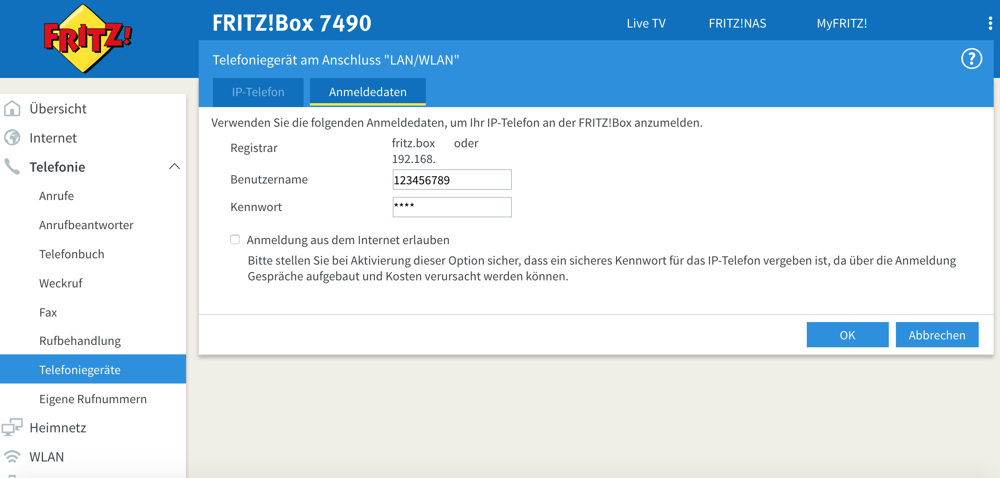
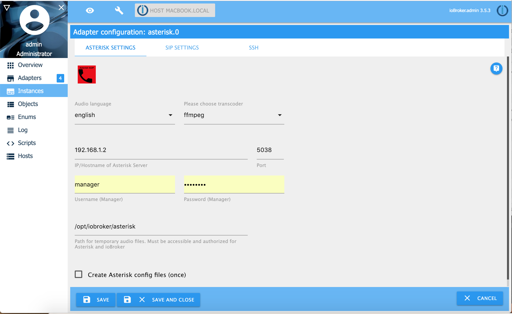

# ioBroker Asterisk VoIP Adapter

## Install & Configuration of Asterisk with the Fritzbox by using SIP 

First you have to install all the packages described [here](../README.md).

First you have to open the Fritzbox configuration and add a new LAN/WLAN telephone device. In my example, the FritzBox has the IP address 192.168.1.1 and the user name is *12345689* und the password is *mypassword* . The telphone number for outgoing and incoming calls is *03047114711*.


If you do not want, that ioBroker answer the phone, please leave "nur auf folgende Rufnummern reagieren" empty.  Important, the Fritzbox username (Benutzername) musst only consist of numbers. Example: 12345689, 00004711 or 47110815 !!



 
First you have to configure the connection from ioBroker to the Asterisk server on "Asterisk Settings" tab. 
This configuration is independent if you use as SIP Provider your Fritzbox, Telekom, Sipgate or an other vendor. Normaly the username is **manager** . You can choose any password you want. But manager username and manager password in ioBroker must be the same as in the manager.conf later.



If you are done with the configuration of "Asterisk Settings" you switch to the "SIP Settings" tab. Choose **sip** as Service. Now you have to enter following:

1. IP/Hostname of SIP Server : your IP address of your Fritzbox (in our example 192.18.1.1)  
2. Username of SIP Server: insert your Benutzername on Anmeldedaten of your Fritbox Telefoniegerät (in our example 123456789)
3. Password of SIP Server: insert your Kennwort on Anmeldedaten of your Fritbox Telefoniegerät (in our example 123456789)


Leave the "SSH" tab empty if asterisk and iobroker runs on the same machine (server). If you want to use ssh look here: Configuration [ssh/scp ](docs/SSH.md) (ioBroker and asterisk runs on different server).

### Automatic creating asterisk configruation files

Now you go on the "Asterisk Settings" tab and activate the checkbox "create asterisk config files (once)". Save and start the Asterisk instance. 
copy following files from your /tmp/ to the /etc/asterisk/ directory. Please take a look first which user rights the files have before copying in  /etc/asterisk . Maybe you have to adjust the user rights afterwards.

```sh
sudo mv /tmp/extensions.ael /etc/asterisk/extensions.ael
sudo mv /tmp/manager.conf /etc/asterisk/manager.conf
sudo mv /tmp/sip_fritzbox.conf /etc/asterisk/sip.conf
sudo mv /tmp/rtp.conf /etc/asterisk/rtp.conf

# Example if userrights of files have owner asterisk and group asterisk
sudo chown asterisk:asterisk  /etc/asterisk/extensions.ael
sudo chown asterisk:asterisk /etc/asterisk/manager.conf
sudo chown asterisk:asterisk /etc/asterisk/sip.conf
sudo chown asterisk:asterisk /etc/asterisk/rtp.conf
```

Now start asterisk again. For example with /etc/init.d/asterisk restart and restart the Asterisk iobroker instance. 
Everything shall work now and you are done with the configuration.
Please delete all config files in the /tmp/ directory, because your password is provide in the files.

### Manual creating asterisk configruation files

Instead of creating the config files automaticly, you can do it by your own. 
Now you have to edit the follwoing asterisk configuration files. Delete the old staff in this 4 files! 
Do not change the user authority and user rights of the files. 

**/etc/asterisk/manager.conf**
```sh
[general]						; Do not change
enabled = yes						; Do not change
port = 5038						; Do not change
bindaddr = 0.0.0.0					; Do not change

[manager]						; Do not change
secret = managerpassword				; Change Manager password for ioBroker asterisk adapter
permit = 192.168.1.0/255.255.255.0  			; Change to your subnet and netmask
read = all						; Do not change
write = all						; Do not change
```

You have to change in */etc/asterisk/manager.conf* the values *secret*, *permit* (your subnet + subnet mask). 

**/etc/asterisk/rtp.conf**
```sh
[general]
rtpstart=30000
rtpend=30100
```
You have to change in */etc/asterisk/rtp.conf* nothing. Copy only this file.

**/etc/asterisk/sip.conf** 
```sh
[general]				; Do not change
port = 5060				; Do not change
bindaddr = 0.0.0.0			; Do not change
context = default			; Do not change
subscribecontext = default		; Do not change


register => 12345689:mypassword@192.168.1.1/1000 ; Username, Password and IP address of Fritzbox WLAN/LAN telephone

[123456789]               		; Change to username of Fritzbox WLAN/LAN telephone
type = friend			    	; Do not change
username = 123456789      		; Change to username of Fritzbox WLAN/LAN telephone
host = 192.168.1.1        		; Change hostname / IP address of Fritzbox
secret = mypassword       		; Change password of Fritzbox WLAN/LAN telephone
fromdomain = 192.168.1.1  		; Change hostname / IP address of Fritzbox
fromuser = 123456789   	  		; Change username of Fritzbox WLAN/LAN telephone
```

You have to change in */etc/asterisk/sip.conf* the *host* (IP Adress of Fritzbox or VoIP Provider), the *secret*, *username*, *fromuser* with the username configured in the Fritzbox or VoIP Provider. 
Change the *callerid* with your phone number configured in the Fritzbox. Important, the Fritzbox username (Benutzername) musst only consist of number. Example: 12345689, 00004711 or 47110815 !!

**/etc/asterisk/extensions.ael**
```sh
context default {
  	1000 => {
        Goto(ael-antwort,s,1);
  	}
}

context ael-ansage {
	_. => {
        Answer();
        Wait(1);
		Read(dtmf,${file}&beep,0,s,${repeat},1);
		if ("${dtmf}"  != "") {
			SayDigits(${dtmf});
		}
		Hangup();
        }
}

context ael-antwort {
	s  => {
		Answer();
		Wait(1);
		Set(repeat=5);
		Read(dtmf,/tmp/asterisk_dtmf&beep,0,s,${repeat},1);
		if ("${dtmf}"  != "") {
			SayDigits(${dtmf});
		}
    		Hangup();
	}
}
```
Copy the content above into the */etc/asterisk/extensions.ael* and do not change anything! If you change something here, your ioBroker dial command will not work.

For starting the asterisk server type */etc/init.d/asterisk start*
Now you have to connect ioBroker with the asterisk server. If the ioBroker and the asterisk server use as IP adress 192.168.1.2 you have to configure this IP and the port, username and password from the */etc/asterisk/manager.conf* and the unsername of your sip.conf (for example 123456789). You have enter a path for temporary audio files. This path must be accessible and authorized for Asterisk and ioBroker. 

